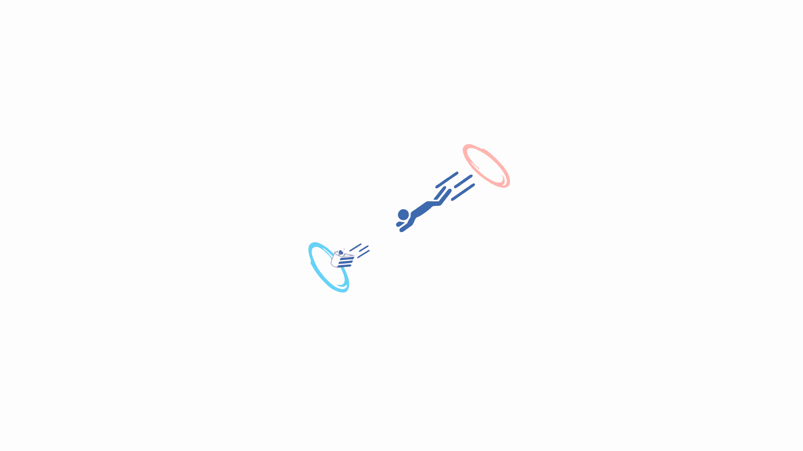

### **
Soho-vibe dots for dwm**

###### *
Just a Rosé Pine rice, nothing more.
*
## Showcase

## Details
Showcased programs:
> alacritty
> dmenu
> dunst
> nvim
> picom
> slstatus
> st
> zen browser
**Fonts**:
* Primary: IBM Plex Mono / BlexMono Nerd Font
* Fallback icons: Font Awesome 6
  
**Wallpaper**:  ([original](./gruv-portal-cake.png))

**Patches**:
* *dmenu*:
    * bar-height
    * bordercolor
    * caseinsensitive
    * lineheight
    * xyw
* *dwm*:
    * actualfullscreen
    * autostart
    * bar-height
    * barpadding
    * centerfirstwindow
    * notitle
    * resizecorners
    * statuspadding
    * togglefloatingcenter
* *st*:
    * anysize
    * blinking-cursor
    * bold-is-not-bright
    * boxdraw
    * glyph-wide-support
    * scrollback (+ scrollback-mouse)
    * w3m
* *slock*:
    * capscolor

**Perks**:
* *dmenu*: [powermenu script](./dmenu/powermenu.sh)
> [!NOTE]
> This script requires st to be installed. If you want to use another terminal, you need to edit it first.
* *dwm*: [slstatus](./slstatus/)
